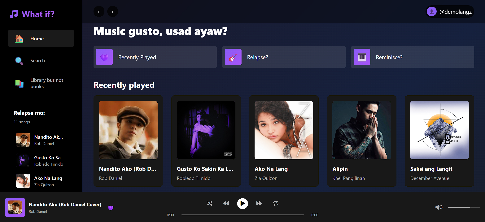
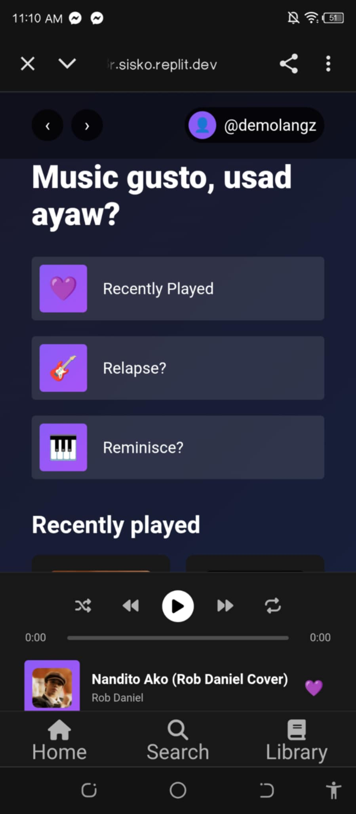

# 🎵 Carnation – (Spoti-Purple Version)

A simple **music player website** that I built with **HTML, CSS, and JavaScript** only :>.  
One of my own **purple-themed spotify-style player** — but with **no ads** and the only downside is the songs that I **add manually** 🫡.  

---

## 📓 Features
-  Play locally added `.mp3` songs (files in the `/songs` folder)
-  Cover art display for each track (`/cover` folder)  
-  Purple Spotify-inspired UI (lolololol)  
-  Player controls: play, pause, skip, repeat and shuffle :D
-  Responsive layout for desktop n mobile! 

---

## 📂 Project Structure
- **Just check the github repo vro 📝**
---

## 🛠️ Tech Stack
- **HTML5** – structure  
- **CSS3** – styling  
- **JavaScript (Vanilla JS)** – player logic  

---

## 📸 Screenshots

---

## ⚡ How to Use
1. Clone or download my repo  
2. Open `index.html` in your browser (for the login experiene yuh)  
3. Select a song that you want and hit play 🎶  

---

## 🌍 Live Demo
Hosted with replit (only developer link for now):
👉 [What If?](https://64afaca5-e3c1-4769-a279-e364b096d08a-00-1nkdeoc6pr88r.sisko.replit.dev/)  

---

## 📌 Notes
- Songs are stored **locally inside `/songs`**. (Skill issue, I have no database...)  
- Covers are stored in `/cover`.  
- This is one of my first ever projects sooo, thank you for using it!

---
## Updates:
- Version RELEASE: BETA 1
